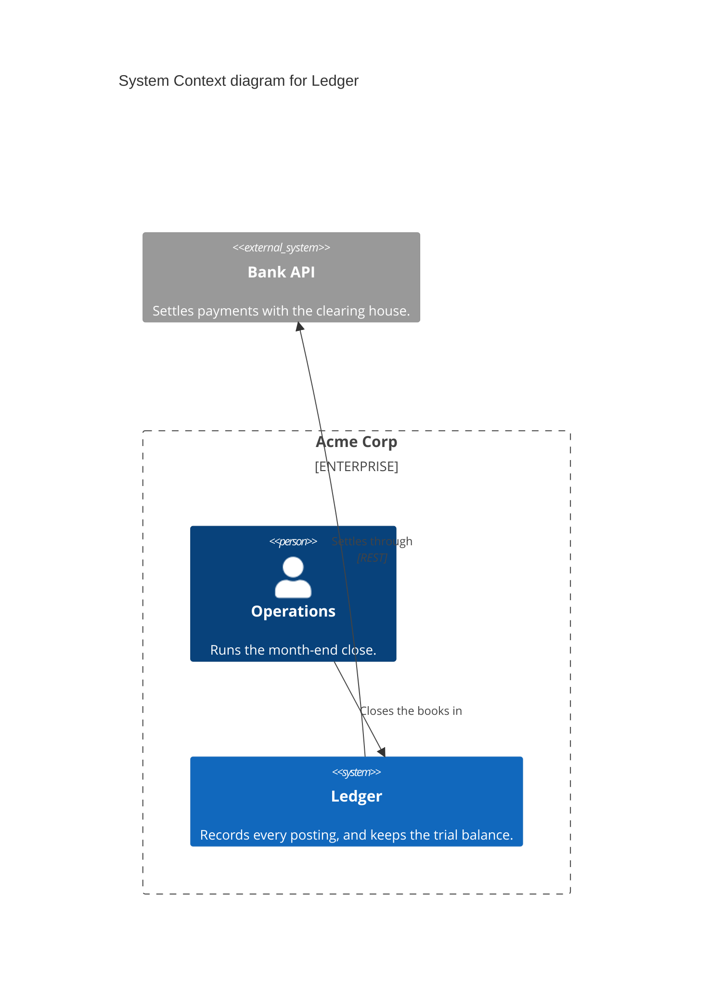
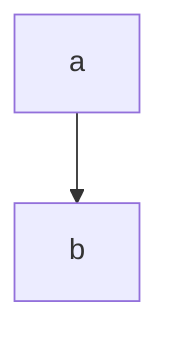

# A worked import

Two blocks in one Markdown file, through to a drawn landscape. Everything below is
real parser output, not a sketch.

## The input

`docs/architecture.md`, with prose around the fences and a non-C4 fence between them:

````markdown
# Our architecture





```mermaid
C4Container
title Container diagram for Ledger
Container_Boundary(ledger, "Ledger") {
  Container(web, "Web UI", "React", "Where accountants work.")
  ContainerQueue(q, "Posting Queue", "Kafka", "Buffers postings before they are applied.")
  ContainerDb(pg, "Ledger Store", "PostgreSQL", "The authoritative double-entry record.")
}
Rel(ops, web, "Closes the books in")
Rel(web, q, "Publishes postings to")
Rel(q, pg, "Writes to")
Rel_Back(pg, web, "Reads balances from")
```
````

Five things in there are traps: the frontmatter, the comment containing a fake
`Person(...)`, the `flowchart` fence, the unquoted label `Operations`, and the
`Rel_Back`.

## Parse

```bash
python scripts/mermaid_c4.py parse docs/architecture.md --out mermaid-c4
```

```
wrote mermaid-c4/model.json — 7 objects, 5 connections
wrote mermaid-c4/diagram-01-*.json — context-diagram 'System Context diagram for Ledger' (3 objects)
wrote mermaid-c4/diagram-02-*.json — app-diagram 'Container diagram for Ledger' (5 objects)
wrote mermaid-c4/report.md

report: reversed 1, merged 1, technologies 4, descriptions 1
read report.md and confirm it with the user before importing
```

Seven objects, not eight. The `Person` inside the comment was ignored, and the
`flowchart` fence was skipped.

### What merging did

`ledger` is declared twice: as a `System` in the context block and as a
`Container_Boundary` in the container block. The alias
ties them together, so `ledger` is one system whose containers came from the second
block:

```
domain    acme    Acme Corp
actor     ops     parent=acme    Operations
system    bank    parent=acme    Bank API           external
system    ledger  parent=acme    Ledger
app       web     parent=ledger  Web UI
store     q       parent=ledger  Posting Queue
store     pg      parent=ledger  Ledger Store
```

`Enterprise_Boundary(acme)` became the domain. `ContainerQueue` became a store.
Neither block ever said that `web` belongs to `ledger`; that came from the boundary.

## The report

```markdown
# Mermaid C4 import — Acme Corp

7 objects, 5 connections, 2 diagrams.

## Connections merged across levels

- **Closes the books in** stated at several levels (ops->ledger, ops->web) —
  one connection authored as `ops` -> `ledger`, redrawn on each diagram

## Reversed by Rel_Back — check each direction

- `Rel_Back` in architecture.md block 2 authored as `web` -> `pg`
  ("Reads balances from") — check the direction reads correctly

## Missing descriptions — generate these

- `acme` (**Acme Corp**, domain) — Mermaid gave no description

## Technology strings to look up

- `web` (**Web UI**) — techn "React", not yet looked up
- `q` (**Posting Queue**) — techn "Kafka", not yet looked up
- `pg` (**Ledger Store**) — techn "PostgreSQL", not yet looked up
- `conn-ledger-bank-settles-through` — techn "REST", not yet looked up
```

Both judgement calls are worth putting to the user in a sentence each:

- **The merge.** "Closes the books in" was written twice, once actor-to-system and once
  actor-to-container. One connection now carries it, authored at the higher level
  because the phrasing suits a business reader. The container diagram still draws it,
  from `ops` to `web`.
- **The reversal.** `Rel_Back(pg, web, "Reads balances from")` renders `pg <-- web`, so
  the relationship runs `web → pg` and the Web UI reads balances from the store. That
  is right here. It often is not — authors reach for `Rel_Back` to move a box and
  reverse a correct relationship by accident, so every one gets checked.

## Fill the gaps

Edit `model.json` directly. Write the missing description and caption:

```json
{ "id": "acme", "name": "Acme Corp", "type": "domain",
  "caption": "Finance platform",
  "description": "The finance product area: ledger, postings and settlement." }
```

Then look the technologies up and attach them. `icon` takes a single technology and is
not implied by `technologyIds`, so repeat it if it should count as both:

```bash
curl -sS -H "X-API-Key: $ICEPANEL_TOKEN" -G \
  "https://api.icepanel.io/v1/catalog/technologies/select" \
  --data-urlencode 'filter[name][]=PostgreSQL' \
  --data-urlencode 'fields[]=name' --data-urlencode 'fields[]=restrictions' \
  --data-urlencode 'fields[]=iconUrlLight' --data-urlencode 'fields[]=iconUrlDark'
```

```json
{ "id": "pg", "name": "Ledger Store", "type": "store", "parentId": "ledger",
  "caption": "The authoritative double-entry record",
  "description": "The authoritative double-entry record.",
  "icon": { "technologyId": "6MZFjMqn4mLaL59WGjTW" },
  "technologyIds": ["6MZFjMqn4mLaL59WGjTW"] }
```

Nothing to do about the labels here: "Publishes postings to", "Writes to" and
"Settles through" are already short verb phrases that read across the arrow, so they
stay exactly as the author wrote them.

## Import and draw

No `groups-NN.json` files were written, because this input has no nested groups. A
`C4Deployment` block would have produced them, and they would go in first, in order.

```bash
IP=../creating-c4-diagrams/scripts/icepanel.py
python $IP import  <landscapeId> mermaid-c4/model.json
python $IP idmap   <landscapeId>
python $IP diagram <landscapeId> mermaid-c4/diagram-01-system-context-diagram-for-ledger.json
python $IP diagram <landscapeId> mermaid-c4/diagram-02-container-diagram-for-ledger.json
python $IP verify  <landscapeId>
```

## The generated layout

Mermaid supplies no coordinates, so both diagrams are placed from the relationship
graph on the 384 × 320 pitch:

```
context-diagram on @root                app-diagram on ledger
  box   ops      (   0,    0)             box   ops      (   0,    0)
  box   ledger   (   0,  320)             area  ledger   (   0,  320)
  box   bank     (   0,  640)             box   web      (   0,  320)
                                          box   q        (   0,  640)
                                          box   pg       (   0,  960)
```

Both read top-down in C4 order: the actor initiates, the subject sits in the middle,
dependencies fall below. On the app diagram `ops` sits above the `ledger` boundary
rather than level with it, because an area is auto-sized around its children — a
non-member left inside that span would be swallowed by a boundary it does not belong
to.

The connection on the app diagram is the interesting one. It points at the same model
connection as the context diagram, drawn between different objects:

```json
{ "ref": "conn-ops-ledger-closes-the-books-in", "from": "ops", "to": "web" }
```

## What to tell the user

- `ledger` was recovered as a system from two blocks; nothing in either block said so
  outright.
- `Enterprise_Boundary(acme)` became the domain, and the queue became a store.
- "Closes the books in" is one connection drawn at both levels.
- The `Rel_Back` direction was checked and reads correctly.
- **The layout is generated and needs their eye.** Placement is the only lever, so if a
  line looks wrong the fix is to move a box.
- The landscape link: `https://app.icepanel.io/landscapes/{landscapeId}`.
